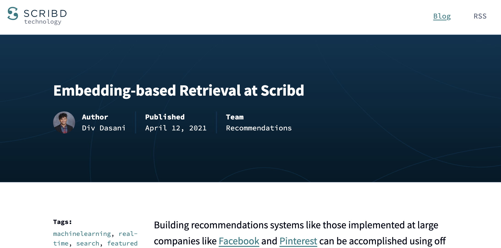
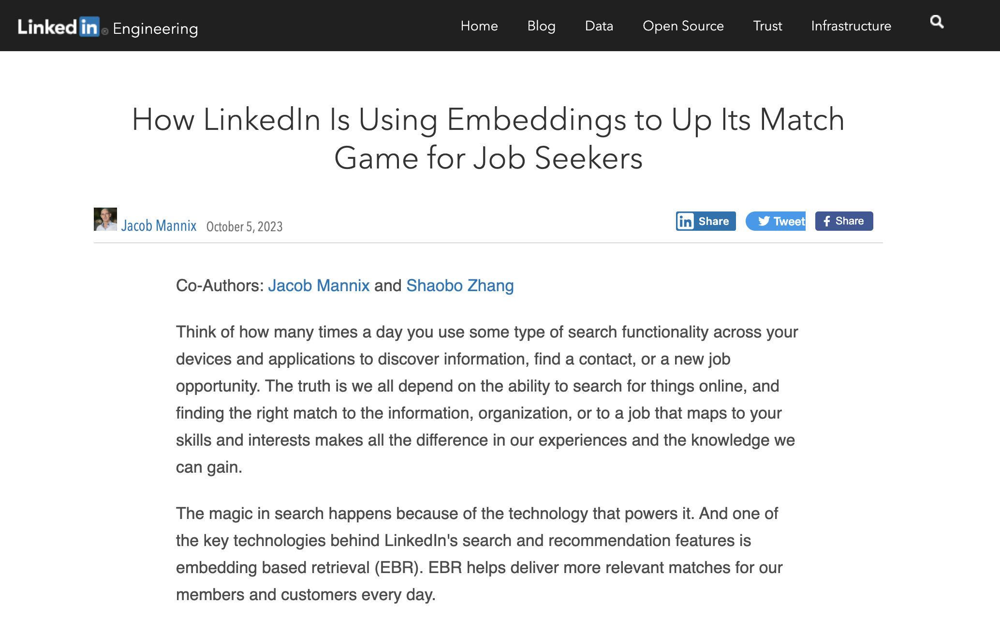
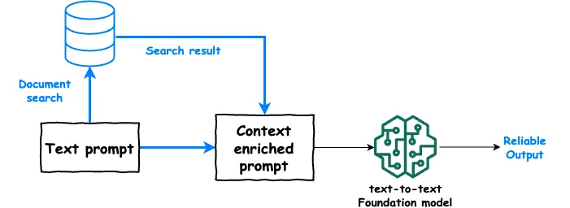
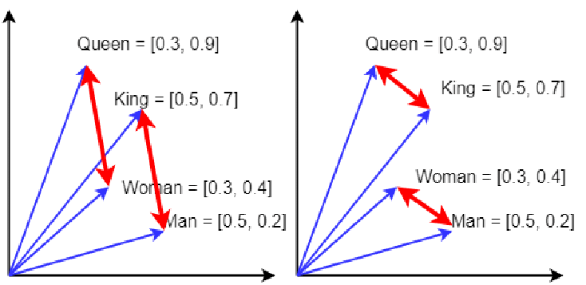

# Introduction

## Importance of Document Retrieval

- Powerful, cheap strategy for building new product features

---

https://tech.scribd.com/blog/2021/embedding-based-retrieval-scribd.html

---

https://engineering.linkedin.com/blog/2023/how-linkedin-is-using-embeddings-to-up-its-match-game-for-job-se

---

## Traditional Methods and Their Limitations

- **Keyword-based Searching**: Explicitly matching terms
- **Boolean Queries**: Using logical operators (AND, OR, NOT)

**Limitations**:

- Lack of semantic understanding
- Low relevance
- Manual optimization needed

---

## Retrieval-Augmented Generation

https://learn.microsoft.com/en-us/azure/search/retrieval-augmented-generation-overview

---

# The Basics of Embeddings

## What are Embeddings?

- Converting words to numerical space
- Example: Man <-> Woman is similar to King <-> Queen

---

---

## Difference from Traditional Methods

- Understands semantic context
- Example: Differentiates "Apple" the company from "apple" the fruit

# Demo 

# Brainstorming: Textual Datasets

(Three minutes, Groups of three)

Think of as many different textual datasets as you can three minutes.

# Brainstorming: Building Context

(Five minutes, Groups of three)

Pick one set.

- Think of a context you can build with that data
   - What field or area or discipline or topic can this data be used to support GPT in answering questions?
- Name that context.
- Come up with five questions that you think GPT could answer give that context.

# Brainstorming: Present

Share your context and questions with the cohort.